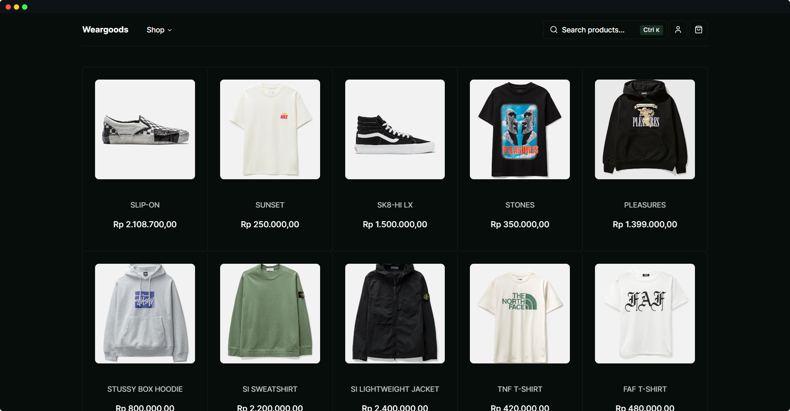

[](https://weargoods-shop.vercel.app/)

 <h1 align="center">weargoods-shop</h1>


<p align="center">This is an open source e-commerce storefront build with everything new in Next.js 13 and Swell.Js</p>


## Tech Stack

- [Next.js](https://nextjs.org)
- [shadcn/ui](https://ui.shadcn.com/)
- [Tailwind CSS](https://tailwindcss.com)
- [Swell](https://www.swell.is/)
- [React Email](https://react.email)

## Roadmap

- [x] Full e-commerce support:
  - Product Detail Page
  - Product Overview Page
  - Search Product
  - Filter Product
  - Product Collections
  - Cart & Checkout
  - User Accounts
- [x] Admin dashboard with auth, products, orders, subscriptions, and payments checkout with **Swell**
- [x] Dark Mode
- [ ] Seller and customer workflows
- [ ] Order Details
- [ ] Blog using **MDX** and **Contentlayer**
- [ ] Newsletter subscription with **React Email** and **Resend**

## Installation

1. Create your account on [Swell](https://www.swell.is/) and get your API keys
2. Clone the repository:

   ```bash
   git clone https://github.com/cahyawibawa/weargoods-shop.git`
   ```

3. Install the dependencies:

   ```bash
   pnpm install
   ```

4. Set your environment variables:

   ```bash
   mv .env.example .env.local
   ```

5. Run the development server:

   ```bash
   pnpm dev
   ```

6. Open [http://localhost:3000](http://localhost:3000) with your browser to see the result.

## Credits

[skateshop.sadmn.com](https://skateshop.sadmn.com/)
